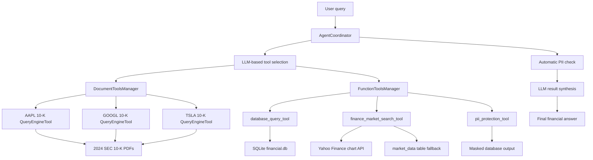
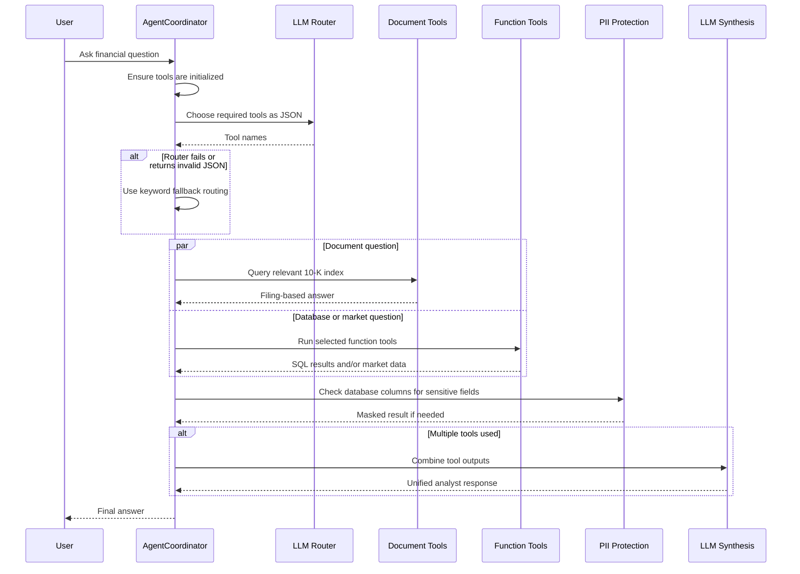
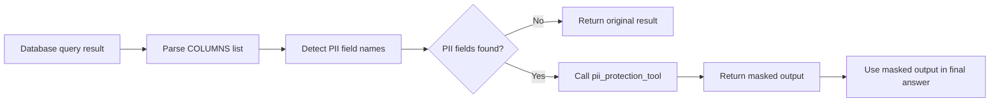
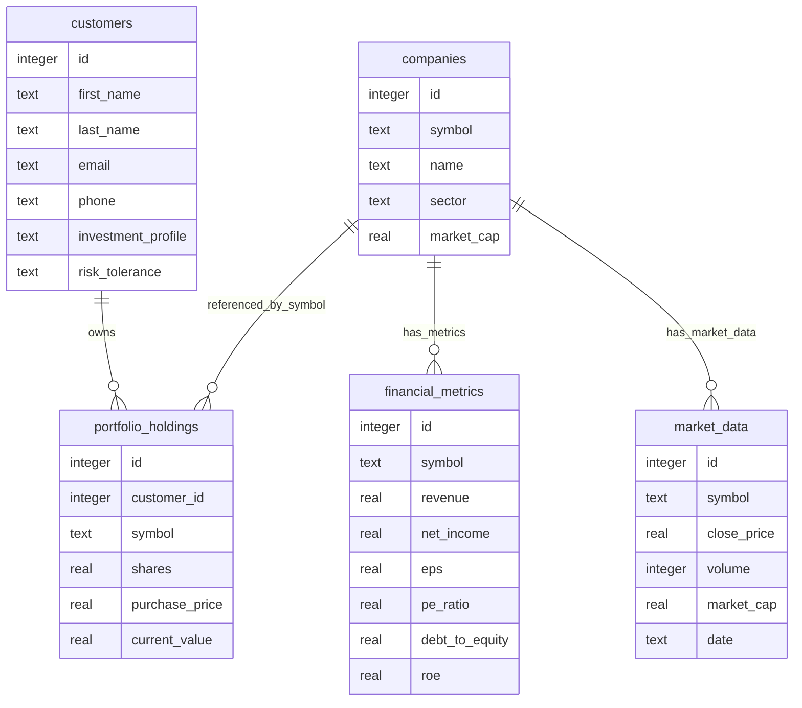

# FinTool Analyst: Modular Agentic Financial Analysis System

FinTool Analyst is a completed multi-tool financial analyst agent built for the Udacity Agentic AI for Financial Services project. It answers financial questions by coordinating across SEC filing analysis, internal customer portfolio data, live market data, and automatic privacy protection.

The project is intentionally modular: each capability is implemented as a focused tool manager, and the coordinator agent decides which tools are needed for each user query.

## What The System Does

The agent can answer questions such as:

- "What are Apple's main business risks according to its 10-K filing?"
- "Show me customers who own Tesla stock."
- "Compare current Tesla stock price with our customer Tesla holdings."
- "Analyze Apple comprehensively using its 10-K, customer holdings, and current market price."

Depending on the question, the system can:

- Search 2024 10-K filings for Apple, Alphabet/Google, and Tesla.
- Generate safe SQLite `SELECT` queries from natural language.
- Retrieve current market data from Yahoo Finance, with local database fallback.
- Detect and mask personally identifiable information from database results.
- Combine multiple tool outputs into one analyst-style response.

## High-Level Architecture




## Core Modules

### 1. DocumentToolsManager

File: `src/helper_modules/document_tools.py`

This module handles document retrieval and 10-K analysis.

Responsibilities:

- Configure LlamaIndex with OpenAI LLM and embedding models.
- Load company 10-K PDFs from `src/data/10k_documents/`.
- Split filings into searchable text chunks.
- Add source metadata such as company, sector, document type, and filing year.
- Build one vector index per company.
- Persist vector indexes under `src/data/index_storage/` so later runs can load cached indexes instead of rebuilding them.
- Expose one `QueryEngineTool` per company:
  - `AAPL_10k_filing_tool`
  - `GOOGL_10k_filing_tool`
  - `TSLA_10k_filing_tool`

Conceptually, this is the Retrieval-Augmented Generation layer. The LLM does not memorize the 10-K filings. Instead, LlamaIndex retrieves relevant chunks from the filings and gives those chunks to the LLM when answering filing-specific questions.

### 2. FunctionToolsManager

File: `src/helper_modules/function_tools.py`

This module provides non-document tools: database querying, market data lookup, and privacy protection.

Responsibilities:

- Configure the OpenAI LLM used for SQL generation.
- Describe the SQLite database schema to the LLM.
- Create `database_query_tool`:
  - Converts natural language into SQLite `SELECT` SQL.
  - Blocks non-`SELECT` statements.
  - Executes queries against `src/data/financial.db`.
  - Returns column names plus row results so downstream privacy checks can inspect fields.
- Create `finance_market_search_tool`:
  - Detects supported symbols: AAPL, GOOGL, TSLA.
  - Calls Yahoo Finance chart data.
  - Reports current price, previous close, change, volume, market cap, and source.
  - Falls back to the local `market_data` table if live API access fails.
- Create `pii_protection_tool`:
  - Detects sensitive fields by column name.
  - Masks names, emails, phone numbers, addresses, SSNs, and date-of-birth style fields.
  - Preserves non-sensitive financial fields such as symbol, shares, and current value.

Conceptually, this is the operational data layer. It connects the agent to structured data and external APIs.

### 3. AgentCoordinator

File: `src/helper_modules/agent_coordinator.py`

This module is the agent brain.

Responsibilities:

- Configure shared LlamaIndex settings.
- Create document and function tools through the two tool managers.
- Use LLM-based tool selection to choose the minimum useful set of tools for a query.
- Fall back to deterministic keyword routing if the LLM router output is invalid.
- Execute selected document and function tools.
- Automatically apply PII protection after database results when sensitive columns are detected.
- Synthesize multi-tool outputs into a single answer.

The coordinator deliberately does not ask the LLM to choose the PII tool directly. Privacy protection is automatic and policy-like: if database results contain sensitive fields, masking is applied before final response synthesis.

## Query Execution Flow




## Privacy Flow




Example:

```text
first_name, last_name, email, phone, symbol, shares
```

is transformed into masked customer data while preserving useful portfolio fields:

```text
***** ******, ***@email.com, ***-***-0102, TSLA, 75 shares
```

## Data Sources




Data included in the project:

- `src/data/10k_documents/AAPL_10K_2024.pdf`
- `src/data/10k_documents/GOOGL_10K_2024.pdf`
- `src/data/10k_documents/TSLA_10K_2024.pdf`
- `src/data/financial.db`

## Repository Layout

```text
.
├── README.md
├── docs/
│   └── udacity_rubric_notes.md
└── src/
    ├── README.md
    ├── requirements.txt
    ├── .env.example
    ├── financial_agent_walkthrough.ipynb
    ├── helper_modules/
    │   ├── document_tools.py
    │   ├── function_tools.py
    │   └── agent_coordinator.py
    ├── tests/
    │   ├── test_document_tools.py
    │   ├── test_function_tools.py
    │   ├── test_agent_coordinator.py
    │   └── test_vocareum_setup_for_llama_index.py
    └── data/
        ├── build_database.py
        ├── financial.db
        ├── index_storage/
        └── 10k_documents/
            ├── AAPL_10K_2024.pdf
            ├── GOOGL_10K_2024.pdf
            └── TSLA_10K_2024.pdf
```

`src/data/index_storage/` is generated locally when document indexes are built. It is intentionally ignored by git because it is a runtime cache.

## Environment Setup

Run these commands from `src/`:

```bash
cd src
python -m venv .venv
source .venv/bin/activate
pip install -r requirements.txt
cp .env.example .env
```

Then edit `src/.env`:

```bash
OPENAI_API_KEY=your-openai-api-key
OPENAI_API_BASE=https://api.openai.com/v1
```

This project uses direct OpenAI API access. The original Udacity environment references Vocareum, but the implementation reads `OPENAI_API_BASE` from the environment so it can work with either endpoint.

For notebook execution, make sure Jupyter uses the project virtual environment:

```bash
python -m pip install ipykernel
python -m ipykernel install --user --name agentic-fintool-venv --display-name "Agentic FinTool (.venv)"
```

In Jupyter, select the kernel named `Agentic FinTool (.venv)`.

## Validation

Run these commands from `src/`:

```bash
source .venv/bin/activate
python tests/test_document_tools.py
python tests/test_function_tools.py
python -u tests/test_agent_coordinator.py
```

Latest validation results:

- DocumentToolsManager: 21/21 passed
- FunctionToolsManager: 22/22 passed
- AgentCoordinator: 11/11 passed
- `financial_agent_walkthrough.ipynb`: all cells ran successfully manually


